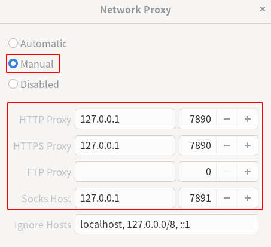

#### unzip

restore the compressed file to its original state and remove the .gz file.
```
gzip -d file.gz
```

To keep the compressed file pass the -k option to the command:
```
gzip -dk file.gz
```

#### find file

name: case sensitive, iname: case insensitive

```
find /path/to/folder -name file-name
find /path/to/folder -name file-name
```

#### clash

1、下载 Clash 客户端

执行 `cd && mkdir clash` 在用户目录下创建 clash 文件夹。

下载适合的 Clash 二进制文件并解压重命名为 clash

一般个人的64位电脑下载 clash-linux-amd64.gz 即可。

```
gunzip -d *.gz
```
2、Clash 配置文件

在终端 cd 到 Clash 二进制文件所在的目录，Clash 配置文件

3、启动 Clash

启动 Clash，同时启动 HTTP 代理和 Socks5 代理。

```
chmod +x clash
./clash -d .
```

Fedora Workstation 34, for example

go to `Setting->Display`



3、管理 Clash

访问 [Clash Dashboard](http://clash.razord.top/) 可以进行切换节点、测延迟等操作。

Host: 127.0.0.1，端口: 9090


### Microsoft software repositories

https://packages.microsoft.com

1.vscode
| Download type       | URL                                                                 |
| ------------------- | ------------------------------------------------------------------- |
| Linux 64 bit        | https://update.code.visualstudio.com/{version}/linux-x64/stable     |
| Linux 64 bit debian | https://update.code.visualstudio.com/{version}/linux-deb-x64/stable |
| Linux 64 bit rpm    | https://update.code.visualstudio.com/{version}/linux-rpm-x64/stable |

https://packages.microsoft.com/repos/code/pool/main/c/code

https://packages.microsoft.com/yumrepos/vscode

2.Edge Insider

https://packages.microsoft.com/repos/edge/pool/main/m/microsoft-edge-dev

https://packages.microsoft.com/yumrepos/edge

### see rpm version number without installing it

```
rpm -qip foo.rpm
less foo.rpm
```

### see deb version number without installing it

```
dpkg-deb -I foo.deb
```

### Ruby

```
sudo dnf install gcc-c++ patch readline readline-devel zlib zlib-devel libyaml-devel libffi-devel openssl-devel make bzip2 autoconf automake libtool bison sqlite-devel

sudo dnf group install "C Development Tools and Libraries"

sudo dnf groupinstall "Development Tools"
```

```
./configure --prefix=/path/to/folder
make
make install
```

### Python

```
sudo dnf install dnf-plugins-core  # install this to use 'dnf builddep'
sudo dnf builddep python3
```

```
./configure --prefix=/path/to/folder
make
make install
```

Flathub镜像

```
sudo flatpak remote-modify flathub --url=https://mirror.sjtu.edu.cn/flathub
```

### 优化 Grub 显示

Grub 实际的配置文件是由多个配置自动生成的，所以这里需要修改多个文件

1. 修改 Grub 分辨率

Grub 默认会使用硬件能够输出的最小分辨率，导致 Grub 界面模糊

查看显卡在 Grub 中能够输出的分辨率

```
sudo hwinfo --framebuffer
```

笔者该命令的输出中，最大分辨率 1920x1080x32

修改`/etc/default/grub`，显示分辨率为刚才查询到的最大分辨率

```
GRUB_GFXMODE=1920x1080x32
```

2. 修改 Grub 中显示的操作系统顺序

`/etc/grub.d/` 目录中存放的是 Grub 能够引导的操作系统的配置文件，按照 启动顺序_操作系统名 生成实际的启动顺序

将第一启动项修改为 Windows，把`30_os-prober`文件前的数字改到小于 `10_linux` 即可

注意：该目录下有一些需要在所有操作系统前启动的配置，例如 `00_header` 和 05_debian_theme，修改的数字要大于这些

### view logs

Use `journalctl` command to view system information.

view all collected journal entries

```
journalctl
```

To view a logs related to a specific file, you can provide the journalctl command with a filepath. The example shown below shows all logs of the kernel device node `/dev/sda`:

```
journalctl /dev/sda
```

To view log for the current boot use the `-b` option :

```
journalctl -b
```

To view kernel logs for the current boot, you can add the `-k` option:

```
journalctl -k -b -1
```

### install python

```
curl -O https://npm.taobao.org/mirrors/python/3.9.0/Python-3.9.0.tar.xz
```

```
./configure --prefix=/home/smith/python3
make
make test
sudo make install
```

This will install Python as `python3`.

`./configure --help`

```
On Fedora and other DNF based systems:
```

sudo dnf install dnf-plugins-core  # install this to use 'dnf builddep'
sudo dnf builddep python3

```

```

```

```

### pyenv

```
git clone https://github.com/pyenv/pyenv.git ~/.pyenv
```

```
nano ~/.bashrc
--------------
export PYENV_ROOT="$HOME/.pyenv"
export PATH="$PYENV_ROOT/bin:$PATH"
```

```
echo -e 'if command -v pyenv 1>/dev/null 2>&1; then\n  eval "$(pyenv init -)"\nfi' >> ~/.bashrc
```

General warning: There are some systems where the BASH_ENV variable is configured to point to .bashrc. On such systems you should almost certainly put the above mentioned line eval "$(pyenv init -)" into .bash_profile, and not into .bashrc. Otherwise you may observe strange behaviour, such as pyenv getting into an infinite loop. See #264 for details.

```
exec "$SHELL"
```

```
pyenv version
python --version
pyenv global 3.7.0
python --version

```

```
cd $(pyenv root)
git pull
```

### install Linux kernel from source

- Debian

```
sudo apt install build-essential libncurses-dev bison flex libssl-dev libelf-dev
```

- Ubuntu

```
sudo apt-get build-dep linux linux-image-$(uname -r)
sudo apt-get install libncurses-dev flex bison openssl libssl-dev dkms libelf-dev libudev-dev libpci-dev libiberty-dev autoconf
```

- Fedora

```
sudo dnf group install "Development Tools"
sudo dnf install ncurses-devel bison flex elfutils-libelf-devel openssl-devel
```

```
mkdir ~/kernelbuild
cd ~/kernelbuild
wget https://mirrors.bfsu.edu.cn/kernel/v5.x/linux-5.9.1.tar.xz
```

```
tar xJvf linux-5.9.1.tar.xz
cd linux-5.9.1
```

```
make menuconfig
KCONFIG_CONFIG make menuconfig
```

KCONFIG_CONFIG

This environment variable can be used to specify a default kernel config file name to override the default name of “.config”.

```
make -j6
make modules_install
make install
```

```
grub-mkconfig -o /boot/grub/grub.cfg
```

### XFS

```
mkfs.xfs /dev/target_partition
```

```
pacman -S xfsprogs
```

repair XFS filesystem

```
unmount /dev/sda1

xfs_repair -v /dev/sda1
```

```
xfs_growsfs /path/to/mnt/point
```

#### 1.Debian, Ubuntu

```
sudo apt update
sudo apt remove package_name
```

```
自动删除无用的包
sudo apt autoremove
查看可更新的软件
sudo apt list --upgradable
```

查看已安装的软件

```
dpkg -l
apt list
apt list --installed
```

```
sudo apt upgarde
sudo apt full-upgrade
```

`apt upgrade`与`apt full-upgrade`相比，可以避免不必要的依赖的包删除。Debian版本(stable, testing, unstable)内的系统更新用`apt upgrade`。

#### Debian, Ubuntu系统更新

Debian Sid

```
sudo apt update
sudo apt upgrade
```

```
/etc/apt/sources.list
---------------------
deb https://mirrors.tuna.tsinghua.edu.cn/debian/ sid main contrib non-free
# deb-src https://mirrors.tuna.tsinghua.edu.cn/debian/ sid main contrib non-free
```

```
sudo apt upgrade
```

Ubuntu

```
sudo apt update
sudo apt upgrade
```

```
/etc/apt/sources.list
---------------------
deb https://mirrors.tuna.tsinghua.edu.cn/ubuntu/ focal main restricted universe multiverse
# deb-src https://mirrors.tuna.tsinghua.edu.cn/ubuntu/ focal main restricted universe multiverse
deb https://mirrors.tuna.tsinghua.edu.cn/ubuntu/ focal-updates main restricted universe multiverse
# deb-src https://mirrors.tuna.tsinghua.edu.cn/ubuntu/ focal-updates main restricted universe multiverse
deb https://mirrors.tuna.tsinghua.edu.cn/ubuntu/ focal-backports main restricted universe multiverse
# deb-src https://mirrors.tuna.tsinghua.edu.cn/ubuntu/ focal-backports main restricted universe multiverse
deb https://mirrors.tuna.tsinghua.edu.cn/ubuntu/ focal-security main restricted universe multiverse
# deb-src https://mirrors.tuna.tsinghua.edu.cn/ubuntu/ focal-security main restricted universe multiverse
```

```
sudo apt upgrade
```

#### install Debian sid

```
/etc/apt/source.list
--------------------
# 默认注释了源码镜像以提高 apt update 速度，如有需要可自行取消注释
deb https://mirrors.bfsu.edu.cn/debian/ bullseye main contrib non-free
# deb-src https://mirrors.bfsu.edu.cn/debian/ bullseye main contrib non-free
deb https://mirrors.bfsu.edu.cn/debian/ bullseye-updates main contrib non-free
# deb-src https://mirrors.bfsu.edu.cn/debian/ bullseye-updates main contrib non-free
deb https://mirrors.bfsu.edu.cn/debian/ bullseye-backports main contrib non-free
# deb-src https://mirrors.bfsu.edu.cn/debian/ bullseye-backports main contrib non-free
deb https://mirrors.bfsu.edu.cn/debian-security bullseye-security main contrib non-free
# deb-src https://mirrors.bfsu.edu.cn/debian-security bullseye-security main contrib non-free
```

```
apt update
apt upgrade
```

```
/etc/apt/source.list
--------------------
deb https://mirrors.bfsu.edu.cn/debian/ sid main contrib non-free
# deb-src https://mirrors.bfsu.edu.cn/debian/ sid main contrib non-free
```

```
apt full-upgrade
reboot
```

install sudo so you can use sudo to do something that needs root privelege

```
apt install sudo
```

change root to a normal user

```
su - user_name
```

install KDE minimal desktop

```
sudo apt install kde-plasma-desktop
sudo reboot
```

#### 2.Fedora


install the package_name without weak dependcies

```
sudo dnf -y install package_name --setopt=install_weak_deps=False
```

```
dnf repoinfo
dnf repolist -v
```

#### 3.OpenSUSE

openSUSE Leap

```
sudo zypper update
```

openSUSE Tumbleweed

```
sudo zypper dup
```

remove a package and its unneeded dependcies

```
sudo zypper remove --clean-deps package_name
sudo zypper rm -u package_name
```

```
sudo zypper packages --orphaned
```

```
zypper repos
zypper lr
zypper ls

zypper ls --uri
zypper ls -u

zypper repos -d
```

```
sudo snapper list
```

```
zypper se package_name
```

```
zypper se -si package_name
```

-s: show all versions of packages and each version in each repository
-i: show installed packages

```
zypper info --requies package_name
zypper info --recommends package_name
```

**install a package or system upgrade without installing recommended packages**

1.temporary solution

```
sudo zypper in --no-recommends package_name

sudo zypper dup --no-recommends
```

2.eternal solution

```
/etc/zyyp/zyyp.conf
-------------------
solver.onlyRequires = true
```

#### 4.Margeia

1.install the specific package

```
sudo urpmi package_name
```

2.remove the specific package and all packages which depend on it

```
sudo urpme package_name
```

3.update all media first, automatically select packages which can be updated and install them

```
sudo urpmi --auto-update
```

**Repository commands**

update all repository

```
sudo urpmi.update -a
```

show all repositories and URLs.

```
urpmq --list-url
```

add a new media with name and URL

```
sudo urpmi.addmedia <name> <URL>
```

remove repositories

```
sudo urpmi.removemedia <name>
```

remove all repositories

```
sudo urpmi.removemedia -a
```

**Search commands**

list all the repositories

```
urpmq --list-media
```

search a package by exact name

```
urpmq package_name
```

```
urpmq --fuzzy package_name
```

search a package by its name and display a summary of the package. The option -Y disables the case-sensivity and enables the fuzzy search mode

```
urpmq --summary -Y package_name
```

display information about a package

```
urpmq -i package_name
```

display the dependcies of a package

```
urpmq --requires package_name
```

**修改软件源**

```
sudo urpmi.removemedia -a

sudo urpmi.addmedia --distrib https://mirrors.tuna.tsinghua.edu.cn/mageia/distrib/7/x86_64
sudo urpmi.addmedia --distrib https://mirrors.tuna.tsinghua.edu.cn/mageia/distrib/cauldron/x86_64

sudo urpmi.addmedia --distrib https://mirrors.ustc.edu.cn/mageia/distrib/7/x86_64
sudo urpmi.addmedia --distrib https://mirrors.ustc.edu.cn/mageia/distrib/cauldron/x86_64

sudo urpmi.update -a
```

清除无用的依赖

```
sudo urpme --auto-orphans
```

**更新系统**

1.

```
urpmi.update -a && urpmi --auto-select
```

2.
测试更新

```
sudo urpmi --replacefiles --auto-update --auto --download-all --test
```

测试完成，开始更新

```
sudo urpmi --replacefiles --auto-update --auto --download-all
```
